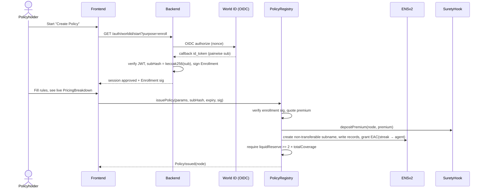
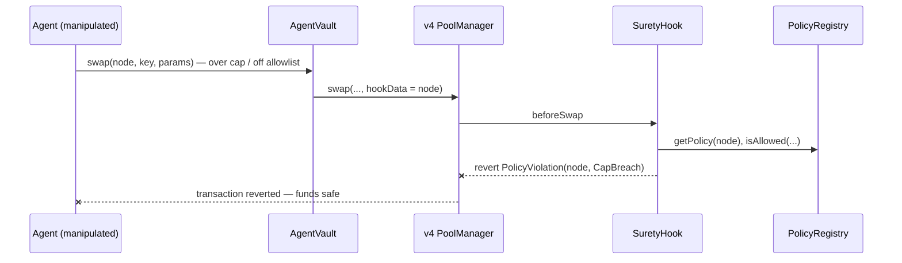
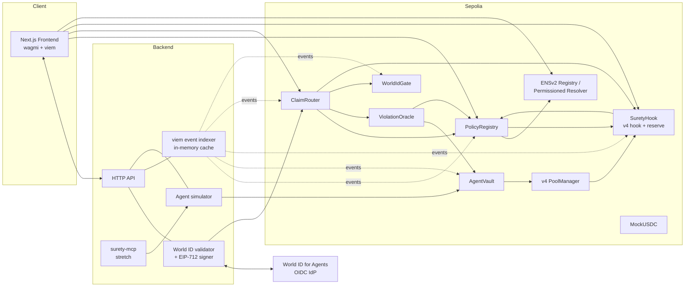

# Surety — Product Requirements Document (Full)

| | |
|---|---|
| **Product** | Surety — parametric, on-chain insurance for AI agents that transact |
| **Event** | ETHGlobal Tokyo, Sep 25–27, 2026 (36-hour hackathon) |
| **Submission deadline** | **9:00 AM JST, Sunday Sep 27, 2026** (internal target 08:00 JST) |
| **Sponsor tracks** | ENS — Best Use of ENSv2 · World — Best Use of World ID for Agents (+ IDKit stretch) · Uniswap Foundation — Best Uniswap Stack Contribution · (bonus) Curvegrid — Best AI Agent Project |
| **Network** | Ethereum Sepolia (required for the ENSv2 beta) |
| **Status** | Build in progress |
| **Owner** | @Rohit |
| **Companion docs** | `docs/TEAM_PLAN.md` (3-person split + timeline), `CLAUDE.md` (project memory), `docs/ARCHITECTURE.md` |

> This PRD merges and reconciles `Surety - Product Requirements Document.pdf` (Sep 24) and `Surety_Claude_Code_Setup_Guide.pdf`. Where they conflicted, the decision taken is recorded in §20 (Decision Log).

---

## Table of Contents

1. [Summary](#1-summary)
2. [Problem](#2-problem)
3. [Market & Competitive Landscape](#3-market--competitive-landscape)
4. [Solution & Thesis](#4-solution--thesis)
5. [Goals, Non-Goals & Success Metrics](#5-goals-non-goals--success-metrics)
6. [Personas](#6-personas)
7. [User Stories](#7-user-stories)
8. [End-to-End Flows](#8-end-to-end-flows)
9. [System Architecture](#9-system-architecture)
10. [ENS Layer Specification](#10-ens-layer-specification)
11. [World ID Layer Specification](#11-world-id-layer-specification)
12. [Uniswap v4 Layer Specification](#12-uniswap-v4-layer-specification)
13. [Violation Detection](#13-violation-detection)
14. [Pricing Model](#14-pricing-model)
15. [Smart Contracts — Detailed Spec](#15-smart-contracts--detailed-spec)
16. [Backend Specification](#16-backend-specification)
17. [Frontend Specification](#17-frontend-specification)
18. [Security Model, Invariants & Threat Model](#18-security-model-invariants--threat-model)
19. [Non-Functional Requirements](#19-non-functional-requirements)
20. [Decision Log](#20-decision-log)
21. [Scope: MVP, Stretch, Out of Scope](#21-scope-mvp-stretch-out-of-scope)
22. [Sponsor Track Alignment & Submission Checklist](#22-sponsor-track-alignment--submission-checklist)
23. [Demo Script](#23-demo-script)
24. [Timeline & Team](#24-timeline--team)
25. [Risks & Mitigations](#25-risks--mitigations)
26. [Repository Structure](#26-repository-structure)
27. [Configuration & Environments](#27-configuration--environments)
28. [Testing Strategy & Acceptance Criteria](#28-testing-strategy--acceptance-criteria)
29. [Future Work](#29-future-work)
30. [Open Questions](#30-open-questions)
31. [Glossary](#31-glossary)
32. [Sources](#32-sources)

---

## 1. Summary

**One-liner:** Surety pays out automatically, same day, when an insured AI agent breaks its own stated policy rules — no adjuster, no lawsuit, no months-long claims process.

**How:** the policy is a verifiable on-chain object (an ENSv2 name whose records *are* the rules), the violation is a verifiable on-chain event (anyone can recompute it from public data), and the payout is a contract execution from a Uniswap v4 hook's reserve — released only after a fresh World ID check proves the *same real human* who bought the policy is the one claiming.

**Category:** parametric on-chain insurance. Not a wallet, not a broker, not a claims-adjuster insurer.

**Thesis:** *ENS proves what the rules are, and World ID proves who's really asking. Remove either one and a specific, nameable attack gets through.*

---

## 2. Problem

### 2.1 Agents now spend money on their own
Autonomous AI agents hold wallets and execute payments, swaps and contract calls without a human in the loop. When an agent is manipulated or malfunctions, the loss is bounded only by whatever guardrails its developer happened to build — and those guardrails are private, unverifiable, and fragile.

### 2.2 Real incidents
| Incident | What happened | Lesson |
|---|---|---|
| **Grok / Bankr wallet — May 4, 2026** | An attacker gifted the agent's wallet an NFT that unlocked elevated permissions, then used a Morse-code-encoded message to trick the agent into transferring roughly **$150,000–$200,000**. A near-identical safety block had stopped a similar attack on the same wallet before — it did not survive a later code rewrite. | Guardrails that live only in private code silently disappear. The *agent's own permissions* were the thing compromised — a signature from that agent proves nothing. |
| **Runaway agent loop (Waxell)** | One agent loop burned **$47,000 over 11 days** before anyone noticed. | Losses accumulate unnoticed; there is no automatic backstop. |

### 2.3 The insurance gap is now contractual
- **91%** of companies plan to use AI (74% of SMBs already do) — HSB / Munich Re survey, March 2026.
- ISO forms underlie **~82%** of U.S. property-and-casualty business; three new exclusion endorsements attaching at general-liability renewals from **January 1, 2026** explicitly carve generative-AI losses **out** of standard policies.
- Result: the businesses deploying agents fastest are losing coverage at the same time.

### 2.4 Today's two bad options
1. Give the agent unlimited spending power and hope.
2. Hand-build custom guardrails that nobody else can see, verify, or price.

---

## 3. Market & Competitive Landscape

| Player | What they do | Gap Surety fills |
|---|---|---|
| **Klaimee** (YC; $5.5M seed, July 2026) | Insures AI agents | Off-chain, broker/human-priced, cannot verify what an agent did on-chain |
| **Armilla** (Lloyd's coverholder) | AI liability incl. "AI agent mistakes" | Bespoke, broker-mediated, priced by a human weeks after the fact, built for lawsuits |
| **Testudo** (Lloyd's-backed) | AI liability, U.S. mid-market, started early 2026 | Same; self-described as very early |
| **ENShell, Immunity** | Agent safety enforcement | No financial backstop — enforcement only |
| **signet, HumanMandate** | ENS + World ID + spending caps | No pool, no pricing, no claims |

**Positioning:** nothing combines (1) enforcement that *defines* the maximum loss, (2) insurance priced from that same enforcement, and (3) human authorization that a compromised agent cannot forge. The early-agent population is the least likely to get a Lloyd's policy and the most exposed.

**Business model (one line for the pitch):** policyholders pay a small premium into a shared pool; backers supply the reserve and earn premiums/LP fees; Surety takes a protocol fee on premiums (not implemented this weekend).

---

## 4. Solution & Thesis

### 4.1 Three pillars
| Pillar | Sponsor | What it does | Why it is load-bearing |
|---|---|---|---|
| **Rules = identity** | ENS (v2) | Each insured agent gets a **non-transferable** ENSv2 subname; its Permissioned Resolver publishes the policy (coverage limit, tier, per-tx cap, counterparty allowlist, streak). Enhanced Access Control lets the agent's key write **only** its streak. | Discoverable by any counterparty with zero integration; field-level permissions; one enumerable namespace for all policies; policy can't be transferred to dodge its identity binding. Rebuilding this in a mapping means reinventing audited infrastructure. |
| **Money + enforcement** | Uniswap v4 | A custom `SuretyHook` holds the pooled reserve, **blocks** rule-breaking swaps in `beforeSwap`, and **releases** verified claim payouts from the liquid reserve. | Premiums from every policyholder combine into one pool — the small premium each pays (not full coverage) is what makes this insurance rather than a deposit. |
| **Human checkpoint** | World ID for Agents | Policyholder enrolls once at purchase (pairwise `sub` stored); every claim payout requires a **fresh** re-authentication whose `sub` must match. Validated server-side. | A wallet signature only proves someone holds a key. It doesn't prove a unique human, the same human, or that the signer isn't the compromised agent — exactly the Grok/Bankr hole. |

### 4.2 "Enforce where you can, insure what gets through"
- **Swaps** routed through the Surety pool are *enforced*: the hook reverts anything over the cap or to an off-allowlist counterparty.
- **Transfers** from the `AgentVault` are *recorded*, not blocked. If one breaks the published rules, that breach is a public, recomputable fact — the insured event.
- One demo shows both: the attack is blocked; the thing that slips through gets paid.

### 4.3 Precisely defined insured event
The insured event is **a recorded AgentVault payment that violates the policy's published rules** (cap breach or off-allowlist counterparty; optionally an attested bad-actor verdict). It is defined so a policyholder cannot trigger and collect their own payout (see §18.3).

---

## 5. Goals, Non-Goals & Success Metrics

### 5.1 Goals (this hackathon)
- G1. A working, deployed, end-to-end flow on Sepolia: enroll → issue policy → violation → claim → deny (held) → re-verify → paid.
- G2. ENSv2 features (Permissioned Registry, Permissioned Resolver, Enhanced Access Control, non-transferability) used centrally, not cosmetically.
- G3. Full World ID for Agents journey (request → completion → validated result → protected action) plus denied/expired/cancelled path, validated server-side.
- G4. A new Uniswap v4 hook that manages pooled premiums, enforces policy on swaps, and gates payout release.
- G5. A 3-minute demo a judge understands from the screen alone.
- G6. Public repo with incremental commit history, README, FEEDBACK.md, AI attribution.

### 5.2 Non-goals
Real actuarial underwriting, multi-claim arbitration, mainnet deployment, reinsurance / correlated-failure coverage, regulatory licensing, fiat rails.

### 5.3 Success metrics
| Metric | Target |
|---|---|
| End-to-end demo on Sepolia without terminal | 3 clean rehearsals in a row |
| Time from violation to payout (verified path) | < 2 minutes on stage |
| Foundry test suite | 100% passing, ≥ 1 test file per contract, AttackReplay green |
| Sponsor submissions | ENS, World, Uniswap (+ Curvegrid) all submitted before 08:00 JST |
| Every state change | Emits a public event visible on Sepolia Etherscan |

---

## 6. Personas

| Persona | Type | Needs | Interacts via |
|---|---|---|---|
| **Policyholder** (business/team running an agent) | Human user | Buy coverage fast, understand the price, get paid quickly when the agent misbehaves, prove it's really them | Frontend `/`, `/policy/*`; World ID |
| **Insured agent** | Actor, not a user | Transact within published rules; build a clean-behavior streak for cheaper tiers | `AgentVault`, SDK/simulator, (stretch) MCP tools |
| **Backer** | Human / capital provider | Supply reserve capital, see solvency | `/feed` (SolvencyBar, Back the pool) |
| **Counterparty agent / service** | Actor | Check whether an agent is insured and on what terms, with zero custom integration | ENS resolution of `agentN.surety.eth` |
| **Judge / auditor / public** | Observer | Verify any claim independently | Sepolia explorer, `/feed`, ENS app |

---

## 7. User Stories

IDs are referenced by acceptance criteria in §28.

**Policyholder**
- US-1. As a policyholder, I verify with World ID once so my policy is bound to me as a unique human.
- US-2. As a policyholder, I set my agent's rules (coverage, per-tx cap, allowlist, tier) and see the premium computed term by term before paying.
- US-3. As a policyholder, I get an ENS name for my agent that shows my policy publicly.
- US-4. As a policyholder, when my agent breaks a rule, I file a claim with one click referencing the violating payment.
- US-5. As a policyholder, I re-verify with World ID at claim time and receive the payout in minutes.
- US-6. As a policyholder, if I cancel or fail verification, my claim is held (not lost, not paid) and I can retry.
- US-7. As a policyholder, my premium drops automatically as my agent's clean streak grows.

**Agent**
- US-8. As an agent, I can pay allowed counterparties within my cap without friction.
- US-9. As an agent, a manipulated swap that breaks my rules is blocked before execution.
- US-10. As an agent, I can update only my own streak — nothing else in my policy.

**Backer**
- US-11. As a backer, I deposit MockUSDC into the reserve and see the reserve vs. 2× coverage ratio.

**Counterparty / public**
- US-12. As a counterparty, I look up `agent1.surety.eth` and see coverage, cap, allowlist and streak.
- US-13. As anyone, I can see every purchase, violation, claim and payout as a public event.

---

## 8. End-to-End Flows

### 8.1 Phase 1 — Coverage setup


### 8.2 Phase 2 — Enforcement (blocked attack)


### 8.3 Phase 3 — Violation → claim → payout
```mermaid
flowchart TD
    A[Agent pay() breaks a rule] --> B[PaymentMade event recorded on-chain]
    B --> C[Policyholder: ClaimRouter.fileClaim node, paymentId]
    C --> D{ViolationOracle.check}
    D -- None --> R[Revert: not a violation]
    D -- CapBreach / OffAllowlist --> E[Claim = Pending]
    E --> F[Fresh World ID for Agents re-auth]
    F -- cancelled / denied / expired / sub mismatch --> G[markHeld → Claim = Held]
    G --> F
    F -- verified, same sub, fresh --> H[Backend signs ClaimApproval]
    H --> I[WorldIdGate.approveClaim]
    I --> J[ClaimRouter.execute]
    J --> K[SuretyHook.releasePayout from liquid reserve]
    K --> L[Claim = Paid · events emitted]
```

### 8.4 Claim state machine
| From | Event | To | Who |
|---|---|---|---|
| — | `fileClaim` (oracle ≠ None, payment unclaimed) | **Pending** | Policyholder |
| Pending | `markHeld(reason)` | **Held** | Backend signer |
| Held | new World ID attempt approved → `approveClaim` | (approved flag) | Backend sig, anyone submits |
| Pending / Held (approved) | `execute` | **Paid** | Anyone (policyholder in UI) |
| Pending / Held | self-dealing check fails at `execute` | **Rejected** | Contract |

`Paid` and `Rejected` are terminal.

---

## 9. System Architecture



**Trust boundaries**
- On-chain contracts trust: each other (fixed addresses wired at deploy), and **only** the `BACKEND_SIGNER` key for World ID results.
- Backend trusts: World ID's JWKS-signed tokens and on-chain state. Nothing from the browser.
- Frontend trusts: nothing it can't read from chain or a backend-signed payload.

---

## 10. ENS Layer Specification

### 10.1 Namespace
- Parent: `surety.eth` on Sepolia ENSv2 (fallback: pre-registered test name, see §25).
- Each policy: `<label>.surety.eth`, e.g. `agent1.surety.eth`. `node = namehash(label.surety.eth)` is the policy's primary key everywhere.

### 10.2 Non-transferability
Subnames are issued with ENSv2 transfer permissions **revoked at issuance** so a policy can never be reassigned to escape its identity binding (World ID `subHash`, payout address).

### 10.3 Resolver records (Permissioned Resolver)
| Key | Value | Written by | Example |
|---|---|---|---|
| `surety.coverageLimit` | uint, MockUSDC base units | Registry (issue) | `10000000000` (10,000 USDC) |
| `surety.perTxCap` | uint | Registry | `500000000` (500 USDC) |
| `surety.allowlist` | comma-separated checksummed addresses | Registry | `0xabc…,0xdef…` |
| `surety.tier` | `0` \| `1` \| `2` | Registry | `1` |
| `surety.premium` | uint, last quoted premium | Registry | `37500000` |
| `surety.streak` | uint (clean periods) | **Agent key only (EAC)** | `12` |
| `surety.policyholder` | address | Registry | |
| `surety.status` | `active` \| `exhausted` | Registry | |
| `addr` | AgentVault address | Registry | |
| `url` | `https://<app>/policy/agent1` | Registry | |

### 10.4 Enhanced Access Control
- The Registry holds full write control over the subname's records.
- The agent's key is granted **exactly one** permission: write `surety.streak`. Any other write by the agent must revert.
- A longer streak unlocks a cheaper tier automatically on renewal/quote — no renegotiation, and unfakeable because only that one key can write only that one field. (Streak is capped in the formula so self-reporting has bounded value; see §14 and §18.)

### 10.5 Resolution rules
- **Always resolve the resolver address fresh at call time** (off-chain: `getEnsResolver` on every read; on-chain: look up via registry). Never hard-code a resolver — it is deployed per-account in ENSv2.
- Enforcement reads the Registry's mirrored `PolicyRecord` (gas, reliability); the ENS records are the published source of truth and are written in the same transaction. Divergence is impossible except via the agent's streak field, which Registry syncs via `updateStreak`.

---

## 11. World ID Layer Specification

Two integrations, **one Partner Prize slot** (ETHGlobal confirmed a partner with multiple tracks counts once).

### 11.1 World ID for Agents (required) — Human Continuity OIDC
Sandbox: `sandbox.auth.world.org`. Used at two moments:

**A. Enrollment (policy purchase) — required, not stretch**
1. Frontend → `GET /auth/worldid/start?purpose=enroll&address=<policyholder>`.
2. Backend creates session, builds OIDC authorize URL (`response_type=code`, `scope=openid`, `state`, `nonce`), redirects.
3. World IdP returns a **pairwise `sub`** — private to Surety's relationship with that person.
4. Backend exchanges code, verifies id_token: signature via JWKS, `iss`, `aud == client_id`, `exp`, `nonce`.
5. `subHash = keccak256(sub)`; backend signs EIP-712 `Enrollment(policyholder, subHash, expiry)`.
6. Frontend passes `(subHash, expiry, sig)` into `issuePolicy`; `WorldIdGate.verifyEnrollment` checks it; `subHash` is stored on the policy.

**B. Claim payout — fresh re-authentication**
1. After `fileClaim`, frontend → `GET /auth/worldid/start?purpose=claim&claimId=N`.
2. Authorize URL forces fresh auth: `prompt=login`, `max_age=0`, `nonce = claim-<chainId>-<claimId>-<random>`.
3. Backend verifies id_token as above **plus**:
   - `nonce` matches the session for this claimId (binds proof to *this* claim),
   - `auth_time` within **120 s** of now (freshness — "right now, for this claim"),
   - `keccak256(sub) == policy.subHash` (same human who bought it).
4. Pass → sign `ClaimApproval(claimId, subHash, authTime, expiry)` → `WorldIdGate.approveClaim` → `ClaimRouter.execute`.
5. Fail → session status `denied` / `expired` / `cancelled` / `mismatch`; backend calls `ClaimRouter.markHeld(claimId, reason)`. Claim is **held, not paid**, and can be retried.

**Rules**
- Validation is **server-side only**. The browser never produces a trusted result.
- Raw `sub` is never written on-chain — only its hash.
- Each approval signature is one-use (`WorldIdGate` stores used claimIds) and expires (default 10 min).

### 11.2 IDKit (stretch) — proof of uniqueness at purchase
- Layered **on top of** enrollment: an IDKit proof-of-personhood check (minimum sufficient credential) before `issuePolicy`, preventing Sybil claim-farming on the shared pool (one human ≠ many policies beyond a cap).
- Not the source of the pairwise `sub` used for continuity.
- Must show a success path + one alternative path (e.g., user not verified → blocked with explanation) and include an integration debrief in the README.
- Attempt first among stretch items — cheapest extra prize.

---

## 12. Uniswap v4 Layer Specification

### 12.1 Pool
- One pool: **MockUSDC / WETH** (Sepolia), fee tier 0.30%, `hooks = SuretyHook`.
- Hook address mined with `HookMiner` to encode permission flags.

### 12.2 Hook permissions
| Permission | Used | Purpose |
|---|---|---|
| `beforeSwap` | ✅ | Enforce policy on agent swaps |
| `afterSwap` | optional | Emit/record agent swap for streak (stretch) |
| others | ❌ | — |

### 12.3 `beforeSwap` enforcement
- `hookData` = `abi.encode(bytes32 node)`; set by `AgentVault.swap`.
- If `hookData` is empty → non-agent swap → allowed (the pool stays usable by anyone).
- If present: only accept when `sender` is the registered `AgentVault` router path; load policy; compute input amount in MockUSDC terms; revert `PolicyViolation(node, CapBreach)` if `> perTxCap`; revert `PolicyViolation(node, OffAllowlist)` if the recipient/counterparty encoded by the vault isn't allowed.
- `enforce` boolean (owner-set) as a live-demo fallback.

### 12.4 Reserve ("two-sided pool split")
- The hook contract custodies MockUSDC as the **liquid reserve**.
- Inflows: `depositPremium` (from Registry), `depositBacking` (backers).
- Optional split (stretch): a configurable share of premiums added as LP liquidity to earn fees. **Payouts never come from the LP position.**
- Outflow: `releasePayout` callable **only** by `ClaimRouter`, only up to `liquidReserve()`.

### 12.5 Known limitation (stated openly)
One shared pool means correlated failure across many agents at once is not solved this weekend — that's a reinsurance layer's job and is explicitly out of scope.

---

## 13. Violation Detection

| # | Type | Evidence | Trust level | MVP? |
|---|---|---|---|---|
| 1 | **CapBreach** | `payment.amount > policy.perTxCap` | Public, recomputable by anyone from the tx + published policy. No oracle. | ✅ |
| 2 | **OffAllowlist** | `payment.to ∉ policy.allowlist` | Public, recomputable. | ✅ |
| 3 | **Attested** | Risk-screening verdict (Intercepta) on the counterparty, signed by backend | Third-party-attested; labeled as such, **not** folded into the public-evidence claim | Stretch |

- Evidence reference = `paymentId` from `AgentVault` (monotonic, on-chain). The oracle reads the payment and policy on-chain — no off-chain inputs for types 1–2.
- MVP trigger is **scripted**: the agent simulator deliberately makes one over-cap payment.
- Answer to "why trust this was a real violation?": *re-run `ViolationOracle.check(paymentId)` yourself.*

---

## 14. Pricing Model

Live, credibility-weighted frequency model — simple by design (real actuarial pricing is out of scope), but every term is visible.

```
n           = policy periods observed for this agent (streak + claims periods)
k           = 10                              credibility constant
Z           = n / (n + k)                     credibility weight, 0 → 1
λ_agent     = claims / max(n, 1)              observed claim frequency
λ_prior     = 5%                              pool-wide prior frequency
λ_post      = Z·λ_agent + (1 − Z)·λ_prior     credibility-weighted frequency
tierLoad    = [1.50, 1.25, 1.00][tier]        tier 0 = riskiest config
streakDisc  = min(streak × 1%, 20%)
premium     = coverage × λ_post × tierLoad × (1 − streakDisc)
```

### 14.1 Worked examples (coverage = 10,000 USDC)
| Case | n | claims | streak | tier | Z | λ_post | tierLoad | disc | **Premium** |
|---|---|---|---|---|---|---|---|---|---|
| New agent | 0 | 0 | 0 | 1 | 0.000 | 5.00% | 1.25 | 0% | **625.00** |
| Clean record | 20 | 0 | 20 | 2 | 0.667 | 1.67% | 1.00 | 20% | **133.33** |
| One claim | 10 | 1 | 5 | 1 | 0.500 | 7.50% | 1.25 | 5% | **890.63** |

### 14.2 Implementation
- `PricingEngine` Solidity library, 1e18 fixed point; returns premium **and** every intermediate term.
- Frontend `usePricing` ports the identical formula to TypeScript; `PricingBreakdown.tsx` renders each line live as the form changes. Cross-checked against the contract on 3 fixtures (above) before demo.
- Tier bounds: tier 2 requires `perTxCap ≤ 5%` of coverage and a non-empty allowlist; tier 1 requires `perTxCap ≤ 20%`; else tier 0. (Tighter rules → cheaper, because enforcement defines max loss.)

---

## 15. Smart Contracts — Detailed Spec

Solidity ^0.8.26, Foundry, Sepolia. All amounts in MockUSDC (6 decimals). `node` = ENS namehash.

### 15.1 Shared types
```solidity
enum ViolationType { None, CapBreach, OffAllowlist, Attested }
enum ClaimStatus   { None, Pending, Held, Paid, Rejected }

struct PolicyRecord {
    address policyholder;
    address agent;
    address payoutAddr;
    uint256 coverageLimit;
    uint256 perTxCap;
    uint8   tier;
    uint32  streak;
    uint32  claimsCount;
    bytes32 subHash;
    uint256 paidOut;
    uint64  issuedAt;
    bool    active;
}
struct Payment { bytes32 node; address to; uint256 amount; uint64 timestamp; }
struct Claim   { bytes32 node; uint256 paymentId; ViolationType vtype; uint256 amount; ClaimStatus status; uint64 filedAt; }
```

### 15.2 Contract catalogue
| Contract | Owner (team) | Responsibility |
|---|---|---|
| `MockUSDC.sol` | A | Mintable ERC20, 6 decimals (testnet only) |
| `PolicyRegistry.sol` | A | Issue policies, ENS subname + records + EAC, policy storage, streak, 2× reserve check |
| `AgentVault.sol` | A | Agent spending wallet keyed by node; records every payment; routes swaps with `hookData` |
| `SuretyHook.sol` | A | v4 hook: `beforeSwap` enforcement; reserve custody; payout release |
| `PricingEngine.sol` (library) | B | Premium quote with all terms |
| `ViolationOracle.sol` | B | Recompute violation type for a payment |
| `WorldIdGate.sol` | B | Verify backend EIP-712 enrollment + claim approvals; replay protection |
| `ClaimRouter.sol` | B | Claim lifecycle entry point; sequences checks; triggers payout |
| ~~`AuditLog.sol`~~ | — | Folded into named events on each contract (§15.8) |

### 15.3 `PolicyRegistry`
```solidity
struct IssueParams { string label; address agent; address payoutAddr; uint256 coverageLimit;
                     uint256 perTxCap; address[] allowlist; uint8 tier; }

function issuePolicy(IssueParams calldata p, bytes32 subHash, uint64 expiry, bytes calldata enrollSig)
    external returns (bytes32 node);
function updateStreak(bytes32 node, uint32 streak) external;          // only policy.agent
function recordPayout(bytes32 node, uint256 amount) external;        // only ClaimRouter
function getPolicy(bytes32 node) external view returns (PolicyRecord memory);
function isAllowed(bytes32 node, address counterparty) external view returns (bool);
function totalCoverage() external view returns (uint256);            // sum of (coverageLimit - paidOut) over active
function quote(IssueParams calldata p, uint32 streak, uint32 claims, uint32 n) external view returns (uint256);
```
**Requirements**
- R-REG-1 `issuePolicy` reverts unless `WorldIdGate.verifyEnrollment(msg.sender, subHash, expiry, sig)`.
- R-REG-2 label unused; `payoutAddr != address(0)`; `perTxCap <= coverageLimit`; tier satisfies §14.2 bounds.
- R-REG-3 premium = `PricingEngine.quote(...)`; pulled from `msg.sender` via `transferFrom`, forwarded to `hook.depositPremium`.
- R-REG-4 creates non-transferable subname; writes §10.3 records; grants EAC `surety.streak` to `p.agent`.
- R-REG-5 after issuing, `hook.liquidReserve() >= 2 * totalCoverage()` else revert `InsufficientReserve`.
- R-REG-6 `updateStreak` only by `agent`; `recordPayout` only by `ClaimRouter`; marks `active=false` when `paidOut == coverageLimit`.
- Events: `PolicyIssued(node, policyholder, agent, coverageLimit, perTxCap, tier, premium)`, `StreakUpdated(node, streak)`, `PolicyExhausted(node)`.

### 15.4 `AgentVault`
```solidity
function deposit(bytes32 node, uint256 amount) external;
function pay(bytes32 node, address to, uint256 amount) external returns (uint256 paymentId); // only policy.agent
function swap(bytes32 node, PoolKey calldata key, IPoolManager.SwapParams calldata params, address counterparty) external;
function withdraw(bytes32 node, uint256 amount) external;           // only policyholder
function getPayment(uint256 paymentId) external view returns (Payment memory);
function balanceOf(bytes32 node) external view returns (uint256);
```
- R-VLT-1 `pay` records every transfer with a monotonic `paymentId` and **does not block** on rule breach (that's the insured event).
- R-VLT-2 `swap` passes `hookData = abi.encode(node, counterparty)`; hook enforces.
- Events: `Deposited(node, amount)`, `PaymentMade(node, paymentId, to, amount)`, `SwapExecuted(node, amountIn, amountOut)`.

### 15.5 `SuretyHook`
```solidity
function depositPremium(bytes32 node, uint256 amount) external;   // only PolicyRegistry
function depositBacking(uint256 amount) external;                 // anyone
function releasePayout(uint256 claimId, address to, uint256 amount) external; // only ClaimRouter
function liquidReserve() external view returns (uint256);
function setEnforce(bool on) external;                            // owner, demo fallback
function beforeSwap(address sender, PoolKey calldata, IPoolManager.SwapParams calldata, bytes calldata hookData)
    external returns (bytes4, BeforeSwapDelta, uint24);
```
- R-HK-1 `beforeSwap` reverts `PolicyViolation(node, reason)` on cap breach / off-allowlist when `enforce`.
- R-HK-2 `releasePayout` transfers from the MockUSDC reserve only; reverts if `amount > liquidReserve()`.
- R-HK-3 LP positions (stretch) are never a payout source.
- Events: `PremiumDeposited(node, amount)`, `BackingDeposited(backer, amount)`, `PayoutReleased(claimId, to, amount)`, `EnforceSet(on)`.

### 15.6 `ViolationOracle`
```solidity
function check(uint256 paymentId) external view returns (ViolationType);
function attest(uint256 paymentId, bytes calldata backendSig) external;  // stretch: Attested
```
- R-ORA-1 CapBreach checked first, then OffAllowlist, then Attested; returns the first match.
- Event (attest only): `ViolationAttested(paymentId, source)`.

### 15.7 `WorldIdGate`
```solidity
function verifyEnrollment(address policyholder, bytes32 subHash, uint64 expiry, bytes calldata sig) external view returns (bool);
function approveClaim(uint256 claimId, bytes32 subHash, uint64 authTime, uint64 expiry, bytes calldata sig) external;
function isApproved(uint256 claimId) external view returns (bool);
function setSigner(address signer) external; // owner
```
- R-GATE-1 EIP-712 domain `{name:"Surety", version:"1", chainId, verifyingContract}`.
- R-GATE-2 `approveClaim` requires sig by `BACKEND_SIGNER`, `block.timestamp <= expiry`, `subHash == policy(claim.node).subHash`, claimId not already approved.
- Event: `ClaimApproved(claimId, authTime)`.

### 15.8 `ClaimRouter`
```solidity
function fileClaim(bytes32 node, uint256 paymentId) external returns (uint256 claimId);
function markHeld(uint256 claimId, string calldata reason) external;   // only BACKEND_SIGNER EOA
function execute(uint256 claimId) external;
function getClaim(uint256 claimId) external view returns (Claim memory);
```
- R-CR-1 `fileClaim`: only `policy.policyholder`; policy active; `payment.node == node`; `oracle.check(paymentId) != None`; `paymentId` not previously claimed → `Pending`; `amount = min(payment.amount, coverageLimit - paidOut)`.
- R-CR-2 `execute`: status ∈ {Pending, Held}; `gate.isApproved(claimId)`; self-dealing checks (§18.3) else `Rejected`; → `hook.releasePayout(claimId, payoutAddr, amount)`; `registry.recordPayout`; `Paid`.
- Events (the audit log): `ClaimFiled(claimId, node, paymentId, vtype, amount)`, `ClaimHeld(claimId, reason)`, `ClaimPaid(claimId, to, amount)`, `ClaimRejected(claimId, reason)`.

### 15.9 Deployment order (`script/Deploy.s.sol`)
1. MockUSDC → 2. WorldIdGate(signer) → 3. PolicyRegistry(ens, gate, usdc) → 4. AgentVault(registry, usdc) → 5. SuretyHook via HookMiner(poolManager, registry, usdc) → 6. ViolationOracle(vault, registry) → 7. ClaimRouter(registry, oracle, gate, hook) → 8. wire roles (registry↔hook, router↔hook/registry, vault↔hook) → 9. initialize MockUSDC/WETH pool → 10. write `deployments/sepolia.json` → 11. verify on Etherscan.

`script/SeedDemo.s.sol`: mint MockUSDC → **fund backing first** (so the 2× invariant can hold) → enroll demo policyholder (pre-signed enrollment) → issue `agent1.surety.eth` → deposit agent funds.

---

## 16. Backend Specification

TypeScript (Node 20), Hono or Express, viem. Stateless except in-memory session + event cache (no database).

### 16.1 Modules
| Path | Responsibility |
|---|---|
| `src/server.ts` | HTTP entrypoint, CORS for frontend origin |
| `src/worldid/verifyProofOfHuman.ts` | Enrollment OIDC flow + `Enrollment` signing |
| `src/worldid/verifyFreshCheck.ts` | Claim re-auth flow, freshness + sub match, `ClaimApproval` signing, `markHeld` on failure |
| `src/worldid/oidc.ts` | Discovery, JWKS cache, code exchange, JWT verification (`jose`) |
| `src/indexer/watchEvents.ts` | viem `watchContractEvent` for all contracts → in-memory feed; backfill from deploy block on start |
| `src/agent/simulator.ts` | Agent key scripts: normal pay ×2 → attack swap (expected revert) → over-cap pay (violation) |
| `src/mcp/server.ts` + `tools/*` | **Stretch:** `surety_pay`, `surety_create_policy`, `surety_file_claim`, `surety_status`, `surety_policy_history` |

### 16.2 HTTP API
| Method | Path | Request | Response |
|---|---|---|---|
| GET | `/health` | — | `{ ok, chainId, block }` |
| GET | `/auth/worldid/start` | `purpose=enroll&address=0x…` or `purpose=claim&claimId=N` | 302 → IdP |
| GET | `/auth/worldid/callback` | `code, state` (or `error`) | 302 → `${FRONTEND_URL}/worldid/return?session=<id>` |
| GET | `/api/worldid/session/:id` | — | `{ purpose, status: "pending"\|"approved"\|"denied"\|"expired"\|"cancelled"\|"mismatch", subHash?, expiry?, authTime?, claimId?, sig? }` |
| GET | `/api/feed` | `?node=&limit=50` | `[{ type, node, claimId?, paymentId?, txHash, block, timestamp, data }]` |
| GET | `/api/policy/:node` | — | `{ policy, ens, payments[], claims[], violations[] }` |
| GET | `/api/solvency` | — | `{ liquidReserve, totalCoverage, ratio, required: 2 }` |
| POST | `/api/agent/step` | `{ step: "normal"\|"attack-swap"\|"violation", node }` | `{ txHash, reverted, revertReason?, paymentId? }` |
| POST | `/api/claims/:id/execute` | — | `{ txHash }` (relays `approveClaim` + `execute` so the demo needs one click) |

### 16.3 Error handling
- IdP `error=access_denied` → `cancelled`; token `exp`/`auth_time` too old → `expired`; `sub` mismatch → `mismatch`; any JWT failure → `denied`. All non-approved outcomes for `purpose=claim` call `markHeld`.
- Chain RPC failures retried 3× with backoff; indexer resumes from last processed block.

---

## 17. Frontend Specification

Next.js (App Router), wagmi + viem, Tailwind, shadcn/ui, Framer Motion. Deployed on Vercel.

### 17.1 Visual language (from the Dribbble "Web3 DeFi Landing Page" reference by Alex Bender for Fancy)
- Near-black background `#0A0A0B`; white primary text; muted gray secondary; **one** accent color used sparingly.
- Floating **pill-shaped nav**: logo left, links center (Create · Demo · Feed · Lookup), cream "Connect" pill right.
- Oversized extra-bold (800–900) display headline only on `/` ("Insure the agent, not the promise.") and on `/demo`'s result state.
- Short, light-weight value line in muted gray top-right of the hero.
- Fully rounded buttons, generous padding, large negative space.
- **Hero visual** (only `/` and `/demo`): Spline embed of a coin + metal ribbon with slow idle rotation, **or** animated CSS/SVG gradient if time is short. No hand-built WebGL.
- Data pages stay clean and dense — no 3D.

### 17.2 Pages
| Route | Purpose | Key elements |
|---|---|---|
| `/` **Create Policy** | Onboarding | Hero; step 1 World ID enroll (`WorldIdPrompt`); step 2 `PolicyForm` (label, agent address, payout address, coverage, per-tx cap, allowlist, tier auto-derived); step 3 `PricingBreakdown` live; step 4 approve USDC + `issuePolicy`; success → link to `/policy/<label>` and the ENS app |
| `/policy/[agentName]` | Policy detail, history, lookup | Search box (counterparty lookup by ENS name); live ENS records (resolver fresh); streak & tier; payments table with violation badges (recomputed via `ViolationOracle.check`); claims list; **File Claim** → `WorldIdPrompt` (claim) → status Pending/Held/Paid with Etherscan links |
| `/demo` **Attack Replay** | The stage | `AttackReplayConsole`: step buttons in script order — ① normal payments ② Grok-style attack swap → **BLOCKED** (revert reason) ③ rule-breaking transfer → **VIOLATION** ④ file claim ⑤ World ID → cancel → **HELD** ⑥ retry → **PAID**; timeline of tx hashes; big result headline |
| `/feed` | Public audit trail + solvency | Global event feed of `ClaimCard`/event rows; `SolvencyBar` (reserve vs 2× coverage); "Back the pool" deposit |
| `/worldid/return` | OIDC return | Polls session, forwards result to originating page |

### 17.3 Components & hooks
`PolicyForm`, `PricingBreakdown` (term-by-term, animated number changes), `WorldIdPrompt` (states: idle, redirecting, pending, approved, denied, expired, cancelled, mismatch), `ClaimCard`, `SolvencyBar`, `AttackReplayConsole`, `EnsRecordCard`, `TxLink`.
Hooks: `usePolicy(node)`, `usePricing(params)`, `useWorldId(purpose, ref)`, `useFeed()`, `useSolvency()`.
Lib: `lib/ens.ts` (resolve resolver **fresh** on every read), `lib/contracts.ts` (addresses from `deployments/sepolia.json` + ABIs), `lib/format.ts` (USDC, addresses, time).

### 17.4 UX requirements
- Every on-chain action shows pending → confirmed → Etherscan link.
- Revert reasons decoded to human text ("Blocked: over per-transaction cap of 500 USDC").
- Works at 400px width; theme-consistent; keyboard-accessible (shadcn primitives).
- No action depends on a client-reported World ID result — UI only reflects backend session status and on-chain state.

---

## 18. Security Model, Invariants & Threat Model

### 18.1 Non-negotiable invariants
1. **Payouts only from the liquid reserve** — never from an LP position or premiums in flight.
2. **`issuePolicy()` reverts if `liquidReserve < 2 × totalCoverage`** after issuing.
3. **Anti-self-dealing:** payout only to the `payoutAddr` fixed at purchase; `payoutAddr` ≠ violating counterparty; each `paymentId` claimable once; each World ID approval usable once (burn-on-payout).
4. **ENS resolver resolved fresh** at call time; never hard-coded.
5. **World ID validated server-side only**; contracts trust only `BACKEND_SIGNER`'s EIP-712 signatures.

### 18.2 Threat model
| Threat | Attack | Mitigation |
|---|---|---|
| Compromised / manipulated agent (Grok/Bankr) | Agent's key tries a large swap or transfer to attacker | Swaps: hook reverts. Transfers: recorded; claim requires the *human's* fresh World ID — the agent's key can't produce it |
| Compromised agent files claim | Agent key calls `fileClaim` | Only `policyholder` can file; payout needs World ID `sub` match |
| Policyholder self-dealing | Policyholder makes agent pay a wallet they control, then claims | Payout goes to fixed `payoutAddr`, which cannot equal the counterparty; per-payment single claim; coverage cap; (stretch) IDKit uniqueness limits Sybil policies. Residual risk acknowledged: collusion via fresh wallets — mitigated economically by premium > expected gain at tier pricing and by coverage limits; full funding-graph analysis is future work |
| Replay | Reuse a ClaimApproval | One-use per claimId + expiry + nonce bound to claimId |
| Stale identity proof | Old World ID session reused | `max_age=0`, `auth_time` within 120 s |
| Identity swap | Transfer the policy/ENS name to someone else | Non-transferable subname; `subHash` bound at issuance |
| Agent inflates streak | Writes a huge streak for a cheap tier | EAC limits agent to one field; discount capped at 20%; streak only used for pricing, never payout |
| Forged client result | Browser claims "verified" | Only backend-signed EIP-712 accepted on-chain |
| Backend signer key compromise | Attacker signs approvals | Still needs a valid on-chain violation + policyholder-filed claim + fixed payout address; signer rotatable via `setSigner`. Documented as hackathon trust assumption |
| Reserve drain / insolvency | Many claims at once | 2× reserve invariant; per-policy coverage cap; correlated risk explicitly out of scope (reinsurance) |
| Hook misuse by third parties | Random swappers blocked | Empty `hookData` → not policy-checked; pool usable by anyone |

### 18.3 Trust assumptions (stated in README)
- Backend signer honestly relays World ID verification results (verification logic is open-source and reproducible).
- ENSv2 beta contracts on Sepolia behave as documented.
- MockUSDC is a test token.

---

## 19. Non-Functional Requirements

| Area | Requirement |
|---|---|
| Transparency | Every purchase, violation, claim, hold, payout emits an indexed event readable on Sepolia Etherscan without special access |
| Performance | Claim verified-path completes in < 2 min on Sepolia; frontend first load < 3 s on Vercel |
| Reliability | Demo policy pre-seeded; fallback subname pre-registered; `enforce` flag fallback; indexer backfills on restart |
| Gas | `beforeSwap` reads a mirrored struct (no string parsing on the hot path) |
| Privacy | Raw World ID `sub` never on-chain or in logs; only `keccak256(sub)` |
| Code quality | One test file per contract; `forge test` green on `main`; TypeScript strict mode |
| Process | Small incremental commits (judges check history); one PR-sized change per commit |
| Open source | Public GitHub repo, MIT license |
| AI attribution | `docs/AI_ATTRIBUTION.md` lists where AI (Claude Code) was used |

---

## 20. Decision Log

| # | Topic | Setup Guide said | PRD (Sep 24) said | **Decision** |
|---|---|---|---|---|
| D1 | Contract set | Registry, AgentVault, Hook, BackerPool, ClaimContract, PricingEngine | Registry, ViolationOracle, WorldIdGate, ClaimRouter, Hook, AuditLog | Union minus duplicates: Registry, AgentVault, Hook, PricingEngine, ViolationOracle, WorldIdGate, ClaimRouter, MockUSDC. BackerPool → Hook. AuditLog → events |
| D2 | Hook role | Revert the attack | Pay the violation | Both — swaps enforced, transfers insured (§4.2) |
| D3 | Pricing | Live λ credibility model | Actuarial pricing out of scope; tier + streak | Simple credibility formula with tier + streak, fully visible (§14) |
| D4 | Pool funding | BackerPool + 2× reserve | Premiums only | Backers required (premiums alone can't reach 2×); seeded by `SeedDemo` |
| D5 | Self-dealing | Reject recipients with a funding link | — | On-chain funding-link tracing infeasible → enforceable rules in §18.1 #3 |
| D6 | Frontend | 6 pages | Claim/policy feed UI | 4 pages + OIDC return (§17.2) |
| D7 | Backend | World ID + indexer + MCP | World ID + indexer + agent SDK | Agent simulator required; MCP stretch |
| D8 | Demo | 4 min | ~3 min | 3 min (§23) |
| D9 | Token | — | — | MockUSDC (6 dp) for all value |
| D10 | Vault model | Per-agent vault | — | One shared AgentVault keyed by node |

---

## 21. Scope: MVP, Stretch, Out of Scope

### 21.1 MVP (must work for the demo)
- [ ] PolicyRegistry with ENSv2 subname, records, EAC streak, non-transferability
- [ ] AgentVault recording payments + routing swaps
- [ ] SuretyHook: `beforeSwap` enforcement, reserve, payout release
- [ ] PricingEngine + live PricingBreakdown
- [ ] ViolationOracle (CapBreach, OffAllowlist) against a scripted trigger
- [ ] WorldIdGate + backend World ID for Agents enrollment and fresh claim check, incl. denied/cancelled/expired → Held
- [ ] ClaimRouter full lifecycle
- [ ] Indexer + feed + SolvencyBar
- [ ] 4 frontend pages on Vercel
- [ ] Foundry tests incl. AttackReplay
- [ ] README, FEEDBACK.md + Uniswap form, AI_ATTRIBUTION.md

### 21.2 Stretch (in priority order)
1. **IDKit** proof-of-uniqueness gating policy purchase (second World prize, same slot)
2. Premium share → LP position (two-sided split)
3. `surety-mcp` MCP server
4. ViolationOracle attested type via Intercepta
5. ZK policy privacy (reuse Warrant's circuit logic)
6. Curvegrid "Best AI Agent Project" submission (README only — do regardless)

### 21.3 Out of scope
Real underwriting / actuarial pricing · multi-claim arbitration · mainnet · reinsurance / secondary market · backer withdrawals & share accounting · fiat · regulatory licensing.

---

## 22. Sponsor Track Alignment & Submission Checklist

| Track | Prize | Their requirement | How Surety meets it | Evidence to link |
|---|---|---|---|---|
| **ENS — Best Use of ENSv2** | $6,000 | Built on ENSv2 (Sepolia); v2 features central; functional demo, live link, open-source repo | The policy **is** an ENS record: Permissioned Registry (non-transferable subnames), Permissioned Resolver (rules), Enhanced Access Control (agent writes streak only) | `PolicyRegistry.sol` lines; `agent1.surety.eth` in ENS app |
| **World — Best Use of World ID for Agents** | $7,500 | Official sandbox; full journey request → completion → validated result → protected action; denied/expired/cancelled path; server-side validation | Enrollment at purchase + fresh re-auth gating payout; both approve and cancel demoed; validation in `backend/src/worldid/` | Backend files; demo video 1:25–2:35 |
| **World — Best Use of IDKit** (stretch) | $7,500 | Real trust moment; minimum-sufficient credential; success + alternative path; integration debrief | Uniqueness gate on purchase against Sybil claim-farming | README debrief section |
| **Uniswap Foundation — Best Uniswap Stack Contribution** | $6,000 | Public repo; `FEEDBACK.md`; completed Developer Feedback Form linking to it; README pointing to contract lines | New v4 hook managing pooled premium, enforcing policy in `beforeSwap`, gating payout release | `SuretyHook.sol` lines; FEEDBACK.md |
| **Curvegrid — Best AI Agent Project** | $1,000 | Idea + execution, README | Same project; MultiBaas not required | README |

**Submission checklist**
- [ ] Repo public, MIT license, incremental history
- [ ] README: pitch, problem, solution, architecture diagram, contract addresses (Etherscan links), line links for ENS + hook, setup/run, tracks, team, trust assumptions
- [ ] Live Vercel URL works against Sepolia
- [ ] Demo video ≤ 3 min
- [ ] FEEDBACK.md + Uniswap Developer Feedback Form submitted
- [ ] AI_ATTRIBUTION.md
- [ ] All contracts verified on Etherscan
- [ ] Submitted to each track before 08:00 JST

---

## 23. Demo Script (~3 minutes)

| Time | Beat | Screen | Proves |
|---|---|---|---|
| 0:00–0:25 | **Cold open.** "91% of companies plan to use AI — and standard policies started excluding AI losses on Jan 1. Surety pays out before the lawyers even get involved." | `/` hero | Problem |
| 0:25–0:55 | **Policy setup.** Show `agent1.surety.eth`: coverage, cap, allowlist, tier, streak; PricingBreakdown terms | `/policy/agent1` + ENS app | ENS |
| 0:55–1:25 | **Violation.** Normal payments ✓ → Grok-style attack swap **BLOCKED** by the v4 hook → a rule-breaking transfer slips through, **flagged on-chain** | `/demo` | Uniswap + public evidence |
| 1:25–2:00 | **Claim, denied first.** File claim → World ID for Agents prompt → cancel → claim **HELD**, not paid | `/demo` | World (denial path) |
| 2:00–2:35 | **Claim, verified.** Retry, complete verification → payout released live from the v4 hook reserve, Etherscan tx | `/demo` → Etherscan | World + Uniswap |
| 2:35–3:00 | **Close.** Audit trail + solvency; three tracks used natively; business model line; thesis line | `/feed` | Transparency |

---

## 24. Timeline & Team

Full breakdown in `docs/TEAM_PLAN.md`.

| Role | Owns |
|---|---|
| **A — Chain (ENS + Uniswap)** | MockUSDC, PolicyRegistry, AgentVault, SuretyHook, deploy/seed scripts, ENS setup, FEEDBACK.md, CONTRACTS.md |
| **B — Trust (World ID + claims + backend)** | PricingEngine, ViolationOracle, WorldIdGate, ClaimRouter, entire backend, IDKit stretch, README/PITCH/AI_ATTRIBUTION/PRICING_MODEL |
| **C — Frontend** | All of `frontend/`, Vercel, demo video |

| Sync (JST) | Gate |
|---|---|
| S0 10:00 Sat | Repo + interfaces locked |
| S1 13:00 | World ID round trip works; hook compiles; ENSv2 subname created → choose fallbacks |
| S2 17:00 | All contracts on Sepolia; addresses + ABIs published |
| S3 22:00 | Full flow end-to-end on Sepolia |
| S4 02:00 Sun | Feature freeze |
| S5 07:00 | Submit (done by 08:00; deadline 09:00) |

---

## 25. Risks & Mitigations

| Risk | Likelihood | Impact | Mitigation | Owner |
|---|---|---|---|---|
| ~24 h left, nothing built | High | High | Ruthless MVP scope; parallel work on locked interfaces; S3 cut-line | All |
| World ID for Agents sandbox is new | Medium | High | Spike before 12:00; attend workshop; mock-IdP fallback with identical server-side validation, clearly labeled | B |
| ENSv2 beta instability / EAC API unclear | Medium | High | Attend workshop; pre-register fallback subname; Registry mirror remains the enforcement source | A |
| v4 hook breaks during integration | Medium | High | Hello-world hook deployed by 12:00; test in isolation; `enforce` flag fallback; vault pre-check fallback | A |
| Sepolia congestion / faucet limits | Medium | Medium | Fund all wallets early; pre-seed demo state; record video from a good run | A/C |
| Frontend/contract formula mismatch | Low | Medium | Cross-check 3 fixtures (§14.1) at S3 | B/C |
| Correlated failure across agents | — | — | Out of scope; stated openly as reinsurance's job | — |
| Backend signer is a trust point | — | Medium | Documented assumption; open-source verifier; rotatable signer | B |

---

## 26. Repository Structure

```
surety/
├── README.md
├── CLAUDE.md                     project memory + invariants
├── .gitignore  .env.example  package.json (workspaces)
├── deployments/sepolia.json      written by Deploy.s.sol
├── contracts/                    Foundry
│   ├── foundry.toml  remappings.txt  .env.example
│   ├── src/
│   │   ├── MockUSDC.sol  PolicyRegistry.sol  AgentVault.sol  SuretyHook.sol
│   │   ├── PricingEngine.sol  ViolationOracle.sol  WorldIdGate.sol  ClaimRouter.sol
│   │   └── interfaces/ IPolicyRegistry.sol IAgentVault.sol ISuretyHook.sol
│   │                   IViolationOracle.sol IWorldIdGate.sol IClaimRouter.sol SuretyTypes.sol
│   ├── script/ Deploy.s.sol  SeedDemo.s.sol
│   └── test/  PolicyRegistry.t.sol AgentVault.t.sol SuretyHook.t.sol PricingEngine.t.sol
│              ViolationOracle.t.sol WorldIdGate.t.sol ClaimRouter.t.sol AttackReplay.t.sol
├── backend/
│   └── src/ server.ts
│            worldid/ oidc.ts verifyProofOfHuman.ts verifyFreshCheck.ts
│            indexer/ watchEvents.ts
│            agent/   simulator.ts
│            mcp/     server.ts tools/*.ts           (stretch)
│            abi/                                    (generated)
├── frontend/
│   ├── app/ layout.tsx page.tsx policy/[agentName]/page.tsx demo/page.tsx feed/page.tsx worldid/return/page.tsx
│   ├── components/ PolicyForm PricingBreakdown WorldIdPrompt ClaimCard SolvencyBar AttackReplayConsole EnsRecordCard TxLink
│   ├── hooks/ usePolicy usePricing useWorldId useFeed useSolvency
│   └── lib/ ens.ts contracts.ts format.ts abi/ mock/
├── docs/ PRD.md TEAM_PLAN.md ARCHITECTURE.md CONTRACTS.md PRICING_MODEL.md
│         AI_ATTRIBUTION.md FEEDBACK.md PITCH.md
└── .claude/agents/ contracts-builder.md frontend-builder.md backend-builder.md docs-writer.md
```

---

## 27. Configuration & Environments

| Scope | Variable | Purpose |
|---|---|---|
| contracts | `SEPOLIA_RPC_URL`, `DEPLOYER_PK`, `ETHERSCAN_API_KEY` | Deploy + verify |
| contracts | `BACKEND_SIGNER`, `POOL_MANAGER`, `ENS_REGISTRY`, `ENS_PARENT_NODE` | Wiring |
| backend | `SEPOLIA_RPC_URL`, `BACKEND_SIGNER_PK`, `AGENT_PK` | Signing + simulator |
| backend | `WORLDID_ISSUER`, `WORLDID_CLIENT_ID`, `WORLDID_CLIENT_SECRET`, `WORLDID_REDIRECT_URI` | OIDC |
| backend | `FRONTEND_URL`, `DEPLOY_BLOCK` | CORS, indexer backfill |
| frontend | `NEXT_PUBLIC_BACKEND_URL`, `NEXT_PUBLIC_RPC_URL`, `NEXT_PUBLIC_CHAIN_ID=11155111` | Runtime |

Secrets only in git-ignored `.env`; every folder ships `.env.example`.

---

## 28. Testing Strategy & Acceptance Criteria

### 28.1 Contract tests (Foundry)
| File | Must cover |
|---|---|
| `PolicyRegistry.t.sol` | issue happy path; bad enrollment sig reverts; 2× reserve revert; agent can write streak only; non-agent streak write reverts; records written |
| `AgentVault.t.sol` | pay records payment even when over cap; only agent can pay; swap passes hookData |
| `SuretyHook.t.sol` | over-cap swap reverts; off-allowlist swap reverts; empty hookData allowed; `enforce=false` bypass; only router can release; release > reserve reverts |
| `PricingEngine.t.sol` | §14.1 fixtures exact; streak cap; tier loads |
| `ViolationOracle.t.sol` | CapBreach, OffAllowlist, None |
| `WorldIdGate.t.sol` | valid sig; wrong signer; expired; replay; subHash mismatch |
| `ClaimRouter.t.sol` | file/hold/approve/execute; non-policyholder file reverts; double claim reverts; payout = min(amount, remaining); payout to fixed address; counterparty == payoutAddr → Rejected |
| **`AttackReplay.t.sol`** | Grok-style manipulated swap reverts **and** rule-breaking transfer → claim → approval → paid; self-dealing claim rejected; replayed approval rejected |

### 28.2 Backend tests
JWT verification with a local JWKS; freshness window; sub mismatch; cancel → markHeld; EIP-712 signature recovers to `BACKEND_SIGNER` and is accepted by a forked `WorldIdGate`.

### 28.3 Acceptance criteria (maps to user stories)
| ID | Given / When / Then |
|---|---|
| AC-1 (US-1,2,3) | Given a verified World ID enrollment, when the policyholder submits the form, then a policy is issued, `agent1.surety.eth` shows its records in the ENS app, and the premium matches PricingBreakdown |
| AC-2 (US-9) | Given an active policy, when the agent swaps above cap via the vault, then the tx reverts with `PolicyViolation(CapBreach)` |
| AC-3 (US-4) | Given an over-cap `pay()`, when the policyholder files a claim, then `ClaimFiled` is emitted with `vtype = CapBreach` |
| AC-4 (US-6) | Given a Pending claim, when World ID is cancelled, then `ClaimHeld` is emitted and no funds move |
| AC-5 (US-5) | Given a Held claim, when World ID re-verification succeeds with the same `sub` within 120 s, then `ClaimPaid` is emitted and `payoutAddr` receives `min(amount, remaining)` from the hook reserve |
| AC-6 (US-10) | When the agent key writes any ENS record other than `surety.streak`, then it reverts |
| AC-7 (US-11) | When a backer deposits, then SolvencyBar updates within one block |
| AC-8 (US-13) | Every step above appears in `/feed` and on Etherscan |
| AC-9 | The §23 script runs end-to-end on the Vercel URL three times in a row without a terminal |

---

## 29. Future Work
- Funding-graph analysis for self-dealing (off-chain risk engine with attested results)
- Reinsurance layer / correlated-failure tranche; backer shares & withdrawals
- Real actuarial pricing from pooled on-chain loss history
- Multi-chain agents; L2 deployment; mainnet ENS
- Policy renewal periods, automated streak attestations from on-chain behavior
- ZK policy privacy (hide allowlist while keeping violations provable)
- MCP-native agents buying and paying through `surety-mcp`

---

## 30. Open Questions
1. Final team assignment for roles A / B / C.
2. World ID for Agents sandbox credentials — obtained? Exact OIDC claims (`auth_time` support, cancel signaling)?
3. ENSv2 Sepolia: exact EAC API and non-transferable subname issuance flow (confirm at workshop).
4. Uniswap v4 PoolManager address on Sepolia; router to use from AgentVault.
5. Hero visual: Spline or CSS gradient?
6. Does `Surety_Full_Specification.docx` exist with a different pricing formula? If so, replace §14.
7. What is in `WhatsApp Video 2026-09-26 at 8.23.21 AM.mp4` (design reference?) — not reviewed.

---

## 31. Glossary
| Term | Meaning |
|---|---|
| **Parametric insurance** | Pays automatically when an objectively measurable trigger occurs, not after loss adjustment |
| **Node** | ENS namehash of the agent's subname; the policy ID |
| **Permissioned Registry / Resolver** | ENSv2 contracts allowing fine-grained control of names and records |
| **EAC** | Enhanced Access Control — ENSv2 per-field write permissions |
| **Pairwise `sub`** | World ID subject identifier unique to the (user, Surety) pair |
| **Fresh check** | Re-authentication with `max_age=0` whose `auth_time` is within the freshness window |
| **v4 hook** | Contract called by the Uniswap v4 PoolManager at swap lifecycle points |
| **Liquid reserve** | MockUSDC held by `SuretyHook`, the only payout source |
| **Streak** | Count of clean behavior periods; drives premium discount |
| **Z / λ** | Credibility weight / claim frequency in the pricing formula |

---

## 32. Sources
- BusinessWire — HSB AI liability insurance launch, 91% survey
- Pearl Health — the missing market for agentic AI insurance
- Shumaker, Loop & Kendrick — ISO's generative-AI exclusion endorsements
- The Insurer / Program Manager — Testudo on the AI liability market
- Insurance for AI Risk in 2026 — Armilla's AI agent mistakes coverage
- Zylos Research — the 2026 AI agent liability and insurance stack
- Waxell — the $47K runaway-agent incident
- Reference docs: code.claude.com/docs · docs.ens.domains/ensv2/overview · sandbox.auth.world.org/docs · docs.uniswap.org/contracts/v4/guides/hooks/hook-deployment · book.getfoundry.sh
